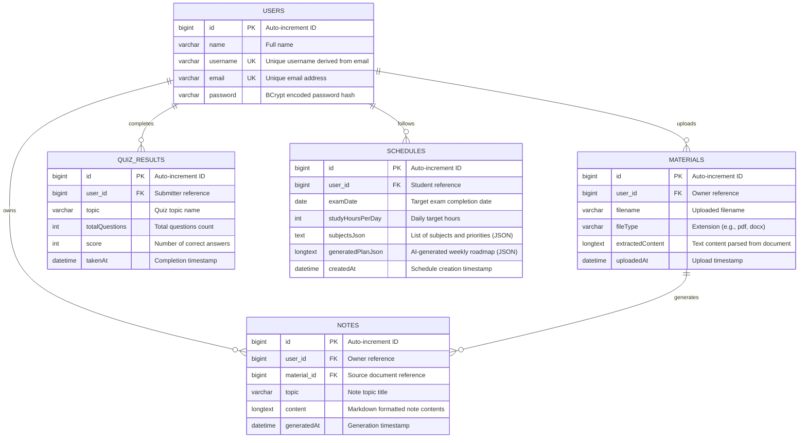

# Database Documentation - SmartPrep AI
This is for my teammates to understand it better.
This directory contains the SQL scripts required to initialize, seed, and manage the database for the **SmartPrep AI - Personalized Learning and Exam Intelligence System**.

## Files in this Directory

* **[schema.sql](file:///d:/Code/Minor/SmartPrep-ai-main/database/schema.sql)**: Contains the DDL (Data Definition Language) commands to create the database schema, all required tables, fields, constraints, and relationships.
* **[seed-data.sql](file:///d:/Code/Minor/SmartPrep-ai-main/database/seed-data.sql)**: Contains the DML (Data Manipulation Language) commands to clear existing records and seed sample/mock data for development, testing, and UI evaluation.

---

## Entity-Relationship  Model



---

## Detailed Table Dictionary

### 1. `users`
Stores user profile information for authentication.
* **id** (BIGINT, Primary Key): Unique auto-incrementing ID.
* **name** (VARCHAR(255), Nullable): Full name of the user.
* **username** (VARCHAR(255), Unique, Not Null): Username used for login identification.
* **email** (VARCHAR(255), Unique, Not Null): Primary email contact.
* **password** (VARCHAR(255), Not Null): BCrypt hashed password.

### 2. `materials`
Stores study files uploaded by students.
* **id** (BIGINT, Primary Key): Unique auto-incrementing ID.
* **user_id** (BIGINT, Foreign Key -> `users.id`): References the user who uploaded the file. Deletes on user cascade.
* **filename** (VARCHAR(255), Not Null): Original filename.
* **file_type** (VARCHAR(50)): Document type (e.g., `pdf`, `docx`, `txt`).
* **extracted_content** (LONGTEXT): Raw text parsed from the uploaded document, used by AI models for notes and quizzes.
* **uploaded_at** (DATETIME, Default: CURRENT_TIMESTAMP): Timestamp when uploaded.
### 3. `notes`
Stores AI-generated study summaries and notes.
* **id** (BIGINT, Primary Key): Unique auto-incrementing ID.
* **user_id** (BIGINT, Foreign Key -> `users.id`): References the note owner. Deletes on user cascade.
* **material_id** (BIGINT, Foreign Key -> `materials.id`, Nullable): References source material file. Set to NULL if source file is deleted.
* **topic** (VARCHAR(255), Not Null): Title or main concept.
* **content** (LONGTEXT): Generated study notes (supports Markdown layout).
* **generated_at** (DATETIME, Default: CURRENT_TIMESTAMP): Generation timestamp.

### 4. `quiz_results`
Stores performance and scores from completed quizzes.
* **id** (BIGINT, Primary Key): Unique auto-incrementing ID.
* **user_id** (BIGINT, Foreign Key -> `users.id`, Nullable): References the student. Set to NULL if user is deleted.
* **topic** (VARCHAR(255)): Topic name for the quiz.
* **total_questions** (INT, Default: 0): Total questions in the quiz.
* **score** (INT, Default: 0): Number of correct responses.
* **taken_at** (DATETIME, Default: CURRENT_TIMESTAMP): Completion timestamp.

### 5. `schedules`
Stores personalized study roadmaps and weekly goals.
* **id** (BIGINT, Primary Key): Unique auto-incrementing ID.
* **user_id** (BIGINT, Foreign Key -> `users.id`): References the student following the plan. Deletes on user cascade.
* **exam_date** (DATE, Not Null): Target deadline or exam date.
* **study_hours_per_day** (INT, Default: 0): Planned study duration.
* **subjects_json** (TEXT): JSON listing subjects, priorities, and custom inputs.
* **generated_plan_json** (LONGTEXT): Detailed weekly study roadmap generated by AI.
* **created_at** (DATETIME, Default: CURRENT_TIMESTAMP): Generation timestamp.

---

## Setup and Run Instructions

### Step 1: Database Creation and Seeding
Using your MySQL Client (CLI, Workbench, phpMyAdmin, DBeaver, etc.), execute the SQL files in order:
1. Open a connection to your MySQL Server.
2. Execute **[schema.sql](file:///d:/Code/Minor/SmartPrep-ai-main/database/schema.sql)** to build the `smartprep` schema and table structure.
3. (Optional) Execute **[seed-data.sql](file:///d:/Code/Minor/SmartPrep-ai-main/database/seed-data.sql)** to populate the database with mock records.

```bash
# Via CLI
mysql -u root -p < database/schema.sql
mysql -u root -p < database/seed-data.sql
```

### Step 2: Configure Spring Boot Backend
Ensure your database connection details match your MySQL credentials in:
`backend/src/main/resources/application.properties`

```properties
spring.datasource.url=jdbc:mysql://localhost:3306/smartprep
spring.datasource.username=YOUR_MYSQL_USERNAME
spring.datasource.password=YOUR_MYSQL_PASSWORD
spring.datasource.driver-class-name=com.mysql.cj.jdbc.Driver

# Hibernate DDL configuration (update maintains existing tables)
spring.jpa.hibernate.ddl-auto=update
spring.jpa.show-sql=true
```
